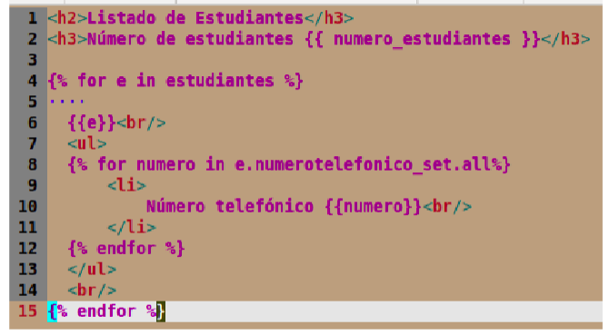

# clase03-2bim

Se usa set.all porque no hay un related_name asociado en la clase numertoTelefonico y de esta forma podemos obtener los numero telefonicos
de los estudiantes de manera facil. 

### 25 junio 2025

Patimos desde crear_numero_telefonico_estudiante en esta vista 
- Buscamos al estudiante por su ID

Luego vamos al if para ver si es un post 
Despues en NumeroTelefonicoEstudianteForm
def __init__(self, estudiante, *args, **kwargs):

en esta parte le decimo que agregue a estudinate como parametro ademas de args que es tuplas y kwargs que nos ayuda con los diccionarios seguidamente en

self.initial['estudiante'] = estudiante 

le decimos pon este estudiante como valor inicial en el campo estudiante porque ya sabemos a que estudiante le debemos agregar el numero.

self.fields["estudiante"].widget = forms.widgets.HiddenInput()

despues ocultamos al campo estudiante pero el valor sigue ahi, si no existiera un incongruencia 